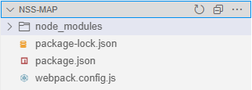
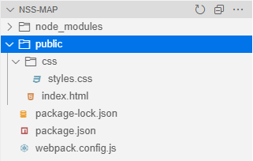
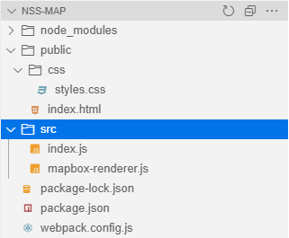
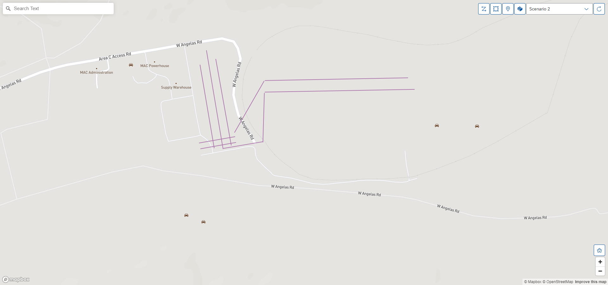

This is a step-by-step guide to develop a simple web application with NSC Client and Mapbox.

# Step 1: Create new map app

In this step, you will create a new project to build your Mapbox app with NSC Client.

1. Open a Terminal or Command Prompt window and navigate to the space where you want to develop the app. Then create a new folder:

    ```shell
    > mkdir nss-map
    > cd nss-map
    ```

2. Run the following command to initilize the project:

    ```shell
    > npm init -y
    ```

3. The command will then generate a `package.json` with the default metadata. Next, install the dependencies:

    ```shell
    > npm i -g live-server
    > npm i @sap/nsc-client mapbox-gl events
    > npm i copy-webpack-plugin webpack webpack-cli --save-dev
    ```

4. Open `package.json` and add the following scripts:

    ```json
    {
        ...
        "scripts": {
            ...
            "build": "webpack --mode=production",
            "start": "live-server --open=index.html?mock=true public"
            ...
        }
        ...
    }
    ```

5. This project uses `Webpack` to build. Hence, you would need to create a Webpack configuration file (`webpack.config.js`) with the following code:

    ```js
    const path = require('path');
    const CopyPlugin = require('copy-webpack-plugin');

    module.exports = {
        entry: './src/index.js',
        plugins: [
            new CopyPlugin({
                patterns: [
                    { from: 'node_modules/@sap/nsc-client', to: './nsc-client' }
                ]
            })
        ],
        output: {
            path: path.resolve(__dirname, 'public'),
            filename: 'bundle.js'
        }
    };
    ```

    > NOTE: For more information on the Webpack configuration, please visit [here](https://webpack.js.org/configuration/).

6. In the end of this step, your folder structure will look as below:

    

# Step 2: Add index.html and CSS style to public folder

In this step, you will create a `public` folder to host the index.html and CSS style files.

1. At the root of the project, create a new directory `public`:

    ```shell
    > mkdir public
    ```

    

2. Create a new `index.html` file and paste the following code. This will serve as the entry page to the web app:

    ```html
    <!DOCTYPE html>
    <html lang="en">

    <head>
        <title>Map</title>

        <meta charset="utf-8" />
        <meta name="viewport"
            content="width=device-width, user-scalable=no, initial-scale=1, maximum-scale=1, minimum-scale=1">

        <link rel="stylesheet" href="css/styles.css">
    </head>

    <body>
        <!-- the container for the map -->
        <div id="container"></div>

        <!-- the js library file for NSC Client -->
        <script src="./nsc-client/bundle.js"></script>

        <!-- the js bundle file built by Webpack -->
        <script src="./bundle.js"></script>
    </body>

    </html>
    ```

3. CSS styles are required to style the app. Next, create a new directory `css` and in the directory, create new CSS file `styles.css` with the following code:

    ```css
    body {
        margin: 0;
        padding: 0;
    }

    #container {
        position: absolute;
        top: 0;
        bottom: 0;
        width: 100%;
    }
    ```

# Step 3: Instantiate NSC Client object

Next, you will be creating a new `src` folder to store all the source code files.

1. At the root of the project, create a new directory `src`.

    ```shell
    > mkdir src
    ```

    

2. In the `src` directory, create a new file `index.js` with the following code:

    ```js
    import MapboxRenderer from "./mapbox-renderer";

    (() => {
        // instantiate the NSC Client object. 2 parameters are required:
        // first: the custom map renderer object
        // second: the element ID of the container in index.html
        return new nsc.Client(new MapboxRenderer, "container");
    })();
    ```

    > NOTE: index.js serves as the entry point for the app and we use this to instantiate the NSC Client including the custom map renderer implementation. 

# Step 4: Create custom map renderer

In this step, you will create the mapbox renderer with it's implementation. To use map renderer with NSC Client, we need to follow the methods define by the MapRenderer interface.

The API for MapRenderer can be found [here](./API.md).

In this guide, we will on focus on implementing the `initialization`, `setBounds`, `addLayers` and it's corresponding methods.

1. Create a new file `mapbox-renderer.js` in the `src` directory.

2. Copy and paste the following code into `mapbox-renderer.js`:

    ```js
    import mapboxgl, { Map, NavigationControl } from "mapbox-gl/dist/mapbox-gl";
    import MapboxDraw from "@mapbox/mapbox-gl-draw";
    import MapboxWorker from "mapbox-gl/dist/mapbox-gl-csp-worker";
    import EventEmitter from "events";

    export default class MapboxRenderer {

        // contructor for the Map Renderer
        constructor() {
            mapboxgl.workerClass = MapboxWorker;

            this._events = new EventEmitter();
        }

        /**************************************************************************
         * ACCESSOR PROPERTIES
         **************************************************************************/

        // getter for map style
        get style() { }

        // setter for map style
        set style(value) { }

        // getter for map center coordinate
        get center() { }

        // setter for map center coordinate
        set center(value) { }

        // getter for map zoom level
        get zoom() { }

        // getter for map zoom level
        set zoom(value) { }

        /**************************************************************************
         * EVENTS & EVENT HANDLERS
         **************************************************************************/

        // handler for click event
        onClick(listener) { }

        // handler for layer click event
        onClickLayer(listener) { }

        // handler for contenxtMenu event
        onContextMenu(listener) { }

        // handler for layer contextMenu event
        onContextMenuLayer(listener) { }

        // handler for draw event
        onDraw(listener) { }

        // handler for selectionChange event
        onSelectionChange(listener) { }

        /**************************************************************************
         * METHODS
         **************************************************************************/

        // initilize the map renderer
        initialize(options) {
            this._apiKey = options.apiKey;

            this._map = new Map({
                accessToken: options.apiKey,
                container: options.container,
                style: options.style || "mapbox://styles/mapbox/dark-v10",
                center: options.center,
                zoom: options.zoom,
                maxBounds: [[-180, -90], [180, 90]]
            });

            this._mapDraw = new MapboxDraw({ displayControlsDefault: false });

            this._map.addControl(new NavigationControl({ showCompass: false }), "bottom-right");
            this._map.addControl(this._mapDraw, "bottom-right");

            return this;
        }

        // adds a layer into the map
        addLayer(layer) {
            if (this._isFullyLoaded) {
                this._addSourceAndLayer(layer);
            } else {
                if (this._map.loaded()) {
                    this._addSourceAndLayer(layer);
                    this._isFullyLoaded = true;
                } else {
                    this._map.once("load", () => {
                        this._addSourceAndLayer(layer);
                        this._isFullyLoaded = true;
                    });
                }
            }
        }

        // adds layers into the map
        addLayers(layers) {
            layers.forEach(layer => {
                this.addLayer(layer);
            });

            return this;
        }

        // hides the layers from the map
        hideLayers(layers) { }

        // zooms the map to the specified zoom level
        zoomTo(zoom) { }

        // remove all geometry features
        removeFeature() { }

        // draw feature (point, polygon or line string) on the map
        draw(mode) { }

        // set bounding box of the map
        setBounds(coordinates, padding) {
            this._map.fitBounds(coordinates, { padding });
        }

        // add search bar
        addSearchBar(featureCollection) { }

        // add source and layer to Mapbox
        _addSourceAndLayer(option) {
            if (this._map) {
                if (this._map.getLayer(option.id)) {
                    this._map.removeLayer(option.id);
                    this._map.removeSource(option.id);
                }

                this._map.addSource(option.id, JSON.parse(JSON.stringify(option.source)));

                const clone = JSON.parse(JSON.stringify(option));
                clone.source = option.id;
                clone.metadata = {
                    customLayer: true
                };
                delete clone.settings;

                const layer = (option.settings ? { ...clone, ...JSON.parse(JSON.stringify(option.settings)) } : clone);
                this._map.addLayer(layer);
            }
        }

    }
    ```

    > NOTE: For the full source code of Mapbox implementation and the explanation of each method/event handler, please see [/src/mapbox-renderer.js](./src/mapbox-renderer.js).

    > NOTE: For more information on Mapbox GL JS API Referernce, please see [here](https://docs.mapbox.com/mapbox-gl-js/api/).

# Step 5: Build the project

1. Run the following command to build the project:

    ```shell
    > npm run build
    ```

2. The build process uses `Webpack` to transpile the source code from `src` folder and place them into the `public` folder. In the meantime, the `copy-webpack-plugin` for Webpack will copy the `nsc-client` library from `node_modules/@sap` folder into the `public` folder.

# Step 6: Run the app locally

1. After the build process is done, the app is ready to start. Run the following command to start the app locally:

    ```shell
    > npm start
    ```

2. The app will start the live server and launch the web app using your default browser with a URL parameter `mock=true`.

    ```url
    http://localhost:8080/?mock=true
    ```

    